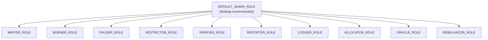

# Access Control & Roles

Every Nexus Protocol contract uses OpenZeppelin's `AccessControl` pattern. This provides fine-grained, role-based permissions enforced at the smart contract level. No off-chain system can override these checks.

---

## Role Architecture

Each contract defines specific roles. Only addresses holding a given role can execute the associated functions. Roles are granted and revoked by the `DEFAULT_ADMIN_ROLE` holder.

---

## Complete Role Matrix

### NexusStableCoin (NUSD)

| Role | Permissions | Recommended Holder |
|------|------------|-------------------|
| `DEFAULT_ADMIN_ROLE` | Grant/revoke all roles, authorize upgrades | Multisig (3-of-5 minimum) |
| `MINTER_ROLE` | Mint new NUSD tokens | MintController contract only |
| `BURNER_ROLE` | Burn NUSD from any address | Authorized redemption service, ETHSwapGateway |
| `PAUSER_ROLE` | Pause/unpause all transfers | Emergency multisig (2-of-3) |
| `RESTRICTOR_ROLE` | Update the RestrictionList reference | Compliance service address |

!!! warning "Critical"
    MINTER_ROLE should only be granted to the MintController contract, not to individual addresses. All minting flows through MintController's allocation system.

### MintController

| Role | Permissions | Recommended Holder |
|------|------------|-------------------|
| `DEFAULT_ADMIN_ROLE` | Grant/revoke roles | Multisig |
| `ADMIN_ROLE` | Reset minted amounts | Operations multisig |
| `ALLOCATOR_ROLE` | Set per-minter ceilings via `setMintAllocation()` | Treasury operations team |

### YieldVault

| Role | Permissions | Recommended Holder |
|------|------------|-------------------|
| `DEFAULT_ADMIN_ROLE` | Grant/revoke roles | Multisig |
| `ADMIN_ROLE` | Update oracle address, set transfer restrictions | Operations multisig |
| `ORACLE_ROLE` | Update the NAV oracle reference | Oracle management service |

### NAVOracle

| Role | Permissions | Recommended Holder |
|------|------------|-------------------|
| `DEFAULT_ADMIN_ROLE` | Grant/revoke reporter role | Multisig |
| `REPORTER_ROLE` | Post NAV updates via `postNAV()` | Automated oracle reporter bot (multisig for production) |

### YieldVaultFactory

| Role | Permissions | Recommended Holder |
|------|------------|-------------------|
| `DEFAULT_ADMIN_ROLE` | Create new vaults via `createVault()` | Operations multisig |

### RestrictionList

| Role | Permissions | Recommended Holder |
|------|------------|-------------------|
| `DEFAULT_ADMIN_ROLE` | Grant/revoke restrictor role | Multisig |
| `RESTRICTOR_ROLE` | Add/remove addresses, batch operations | Compliance service |

### TransferRestrictions

| Role | Permissions | Recommended Holder |
|------|------------|-------------------|
| `DEFAULT_ADMIN_ROLE` | Configure restriction/KYC modules, toggle KYC requirement | Compliance multisig |

### KYCRegistry

| Role | Permissions | Recommended Holder |
|------|------------|-------------------|
| `DEFAULT_ADMIN_ROLE` | Grant/revoke verifier role | Multisig |
| `VERIFIER_ROLE` | Set/revoke KYC status, batch operations | KYC provider service |

### AccreditedInvestor

| Role | Permissions | Recommended Holder |
|------|------------|-------------------|
| `DEFAULT_ADMIN_ROLE` | Grant/revoke verifier role | Multisig |
| `VERIFIER_ROLE` | Set/revoke accreditation status | Compliance officer |

### ReserveTracker

| Role | Permissions | Recommended Holder |
|------|------------|-------------------|
| `DEFAULT_ADMIN_ROLE` | Grant/revoke reporter role | Multisig |
| `REPORTER_ROLE` | Post reserve entries | Automated reserve monitor |

### AuditLog

| Role | Permissions | Recommended Holder |
|------|------------|-------------------|
| `DEFAULT_ADMIN_ROLE` | Grant/revoke logger role | Multisig |
| `LOGGER_ROLE` | Write audit entries | All contracts that should log operations |

### Derivatives Contracts

| Contract | Role | Permissions | Recommended Holder |
|----------|------|------------|-------------------|
| **YieldSplitter** | `DEFAULT_ADMIN_ROLE` | Manage splitter | Multisig |
| **PrincipalToken** | `MINTER_ROLE` | Mint/burn PT | YieldSplitter contract only |
| **YieldToken** | `MINTER_ROLE` | Mint/burn YT | YieldSplitter contract only |
| **CreditVault** | `ADMIN_ROLE` | Update risk parameters | Risk management multisig |
| **ETFWrapper** | `REBALANCER_ROLE` | Rebalance allocations | Operations multisig |

---

## Consolidated Role Table

Every contract and every role in one view:

| Contract | DEFAULT_ADMIN | MINTER | BURNER | PAUSER | RESTRICTOR | VERIFIER | REPORTER | LOGGER | ALLOCATOR | ORACLE | ADMIN | REBALANCER |
|----------|:---:|:---:|:---:|:---:|:---:|:---:|:---:|:---:|:---:|:---:|:---:|:---:|
| NexusStableCoin | X | X | X | X | X | | | | | | | |
| MintController | X | | | | | | | | X | | X | |
| YieldVault | X | | | | | | | | | X | X | |
| NAVOracle | X | | | | | | X | | | | | |
| YieldVaultFactory | X | | | | | | | | | | | |
| RestrictionList | X | | | | X | | | | | | | |
| TransferRestrictions | X | | | | | | | | | | | |
| KYCRegistry | X | | | | | X | | | | | | |
| AccreditedInvestor | X | | | | | X | | | | | | |
| ReserveTracker | X | | | | | | X | | | | | |
| AuditLog | X | | | | | | | X | | | | |
| PrincipalToken | X | X | | | | | | | | | | |
| YieldToken | X | X | | | | | | | | | | |
| YieldSplitter | X | | | | | | | | | | | |
| CreditVault | X | | | | | | | | | | X | |
| ETFWrapper | X | | | | | | | | | | | X |

---

## Multisig Recommendations

!!! warning "Production Deployment"
    For mainnet deployment, all `DEFAULT_ADMIN_ROLE` holders MUST be multisig wallets (e.g., Safe/Gnosis Safe). Single-key admin access is acceptable only on testnets.

| Role Category | Recommended Signers | Threshold |
|--------------|-------------------|-----------|
| Protocol admin (DEFAULT_ADMIN) | Board members, C-suite | 3-of-5 |
| Emergency pause | Operations + compliance | 2-of-3 |
| Compliance operations | Compliance team | 2-of-3 |
| Treasury operations | Finance team | 2-of-4 |

---

## Current Testnet State

!!! note "Testnet Only"
    On Base Sepolia, all roles are currently held by the deployer address (`0x41521c37dB02956185437C4e2461261A321073E1`). This is for development convenience only and will be distributed to appropriate multisigs before any mainnet deployment.
