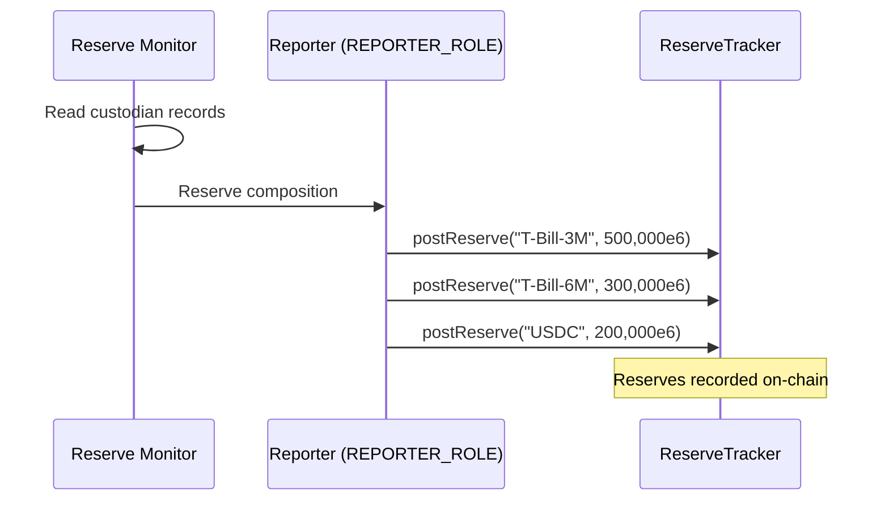
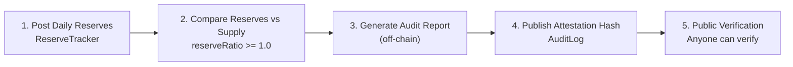

# Audit Trail

How Nexus Protocol maintains an immutable, tamper-proof record of all significant operations.

---

## AuditLog Contract

The `AuditLog` contract provides an on-chain audit trail. Every entry is emitted as an Ethereum event — it is never stored in contract state, keeping gas costs minimal while preserving a permanent record on the blockchain.

### How it works

Authorized addresses (holding `LOGGER_ROLE`) write entries via:

```
AuditLog.log(category, message, data)
```

Each entry emits an `AuditEntry` event containing:

| Field | Type | Description |
|-------|------|-------------|
| `entryId` | `uint256` | Auto-incrementing unique identifier |
| `category` | `string` | Human-readable category (e.g., "MINT", "NAV_UPDATE", "SANCTIONS") |
| `message` | `string` | Descriptive message |
| `data` | `bytes` | Arbitrary encoded data (amounts, addresses, etc.) |
| `logger` | `address` | The address that created the entry |
| `timestamp` | `uint256` | Block timestamp |

### Properties

- **Immutable:** Events cannot be modified or deleted after emission. They are part of the blockchain's permanent record.
- **Tamper-proof:** Only LOGGER_ROLE holders can write entries, and the content is cryptographically linked to the block.
- **Publicly verifiable:** Anyone can query the event logs to reconstruct the full audit history.
- **Gas-efficient:** Events are stored in transaction logs, not contract storage — significantly cheaper than on-chain state.

### Example categories

| Category | When Used |
|----------|----------|
| `MINT` | NUSD minted |
| `BURN` | NUSD burned |
| `NAV_UPDATE` | NAV oracle posts new value |
| `SANCTIONS` | Address restricted or unrestricted |
| `KYC` | KYC status changed |
| `RESERVE` | Reserve composition updated |
| `AUDIT` | Monthly attestation published |
| `PAUSE` | Stablecoin paused or unpaused |
| `UPGRADE` | Contract upgraded |

---

## ReserveTracker Contract

The `ReserveTracker` provides on-chain reserve composition tracking. Reporters post entries that form an auditable history of the assets backing NUSD.

### How it works



### Reserve entry structure

| Field | Type | Description |
|-------|------|-------------|
| `assetType` | `string` | Human-readable identifier (e.g., "T-Bill-3M", "USDC") |
| `amount` | `uint256` | Amount in base units (6 decimals for USD-denominated) |
| `timestamp` | `uint256` | Block timestamp |
| `reporter` | `address` | Address that posted the entry |

### Key operations

| Operation | Role Required | Description |
|-----------|--------------|-------------|
| `postReserve(assetType, amount)` | REPORTER_ROLE | Post a reserve entry |
| `getTotalReserves()` | Public (view) | Sum of latest entries per asset type |
| `getLatestReserve(assetType)` | Public (view) | Latest entry for a specific asset type |
| `getReserveHistory()` | Public (view) | Full history of all entries |

### Reserve ratio verification

The reserve ratio can be computed by anyone:

```
reserveRatio = ReserveTracker.getTotalReserves() / NexusStableCoin.totalSupply()
```

A ratio >= 1.0 means NUSD is fully backed. This check can be automated and run continuously.

!!! warning "Self-Reported"
    Reserve data is self-reported by the REPORTER_ROLE holder. For production, independent auditor attestation is required to validate these figures. See the [Reserve Transparency](../legal-regulatory/reserve-transparency.md) section.

---

## Proof of Reserves Workflow



1. **Daily:** Reserve reporter posts composition to ReserveTracker
2. **Daily:** Automated check compares total reserves against NUSD total supply
3. **Monthly:** Audit reporter generates a report from on-chain data
4. **Monthly:** Attestation hash published to AuditLog
5. **Continuous:** Anyone can verify reserve data and attestation hashes on-chain

---

## Querying the Audit Trail

### For compliance officers

All audit entries are queryable via standard Ethereum event log queries. The event indexer service provides a REST API for filtered access:

- Filter by category (e.g., all SANCTIONS entries)
- Filter by time range
- Filter by logger address
- Full-text search on message field

### For auditors

The complete event history is available on-chain and cannot be altered. Auditors can:

1. Query all `AuditEntry` events from the AuditLog contract
2. Verify reserve composition from `ReserveTracker` events
3. Cross-reference with stablecoin `Transfer` events and vault `Deposit`/`Withdraw` events
4. Reconstruct the full state of the protocol at any historical point in time

### For regulators

The on-chain audit trail provides:

- Immutable record of all compliance-relevant operations
- Cryptographic proof of when each action occurred
- Complete role attribution (which address performed each action)
- Verifiable reserve backing data
