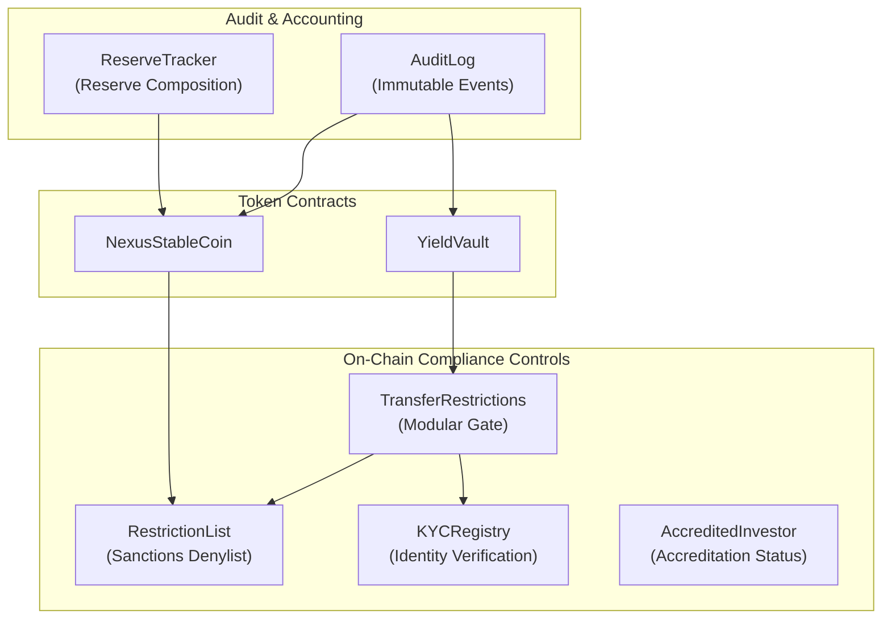

# Compliance Overview

This section is for compliance officers, risk managers, and audit teams. It covers every control mechanism built into Nexus Protocol: who can do what, how transfers are gated, how KYC/AML is enforced, and how the audit trail works.

---

## Compliance Architecture

---

## Key Principles

1. **Every transfer is checked.** Both the stablecoin and vault shares enforce compliance checks on every mint, burn, and transfer.
2. **Denylist is global.** A single RestrictionList contract is shared across all tokens — when an address is sanctioned, it's blocked everywhere.
3. **KYC is time-bounded.** Verifications expire and must be renewed. Expired KYC blocks vault access.
4. **Roles are separated.** No single address controls everything. Minting, burning, pausing, restriction management, and KYC verification are separate roles.
5. **Everything is on-chain.** The AuditLog provides a tamper-proof event trail. Reserve composition is posted and verifiable by anyone.

---

## Quick Links

| Topic | What You'll Find |
|-------|-----------------|
| [Access Control](access-control.md) | Full role matrix for every contract, role hierarchy, multisig recommendations |
| [KYC & AML](kyc-aml.md) | KYCRegistry flows, denylist management, batch operations |
| [Transfer Restrictions](transfer-restrictions.md) | How transfers are gated, which contracts enforce what |
| [Audit Trail](audit-trail.md) | AuditLog contract, ReserveTracker, on-chain evidence |
| [Regulatory Controls](regulatory-controls.md) | Pause mechanism, upgrade authority, emergency procedures |
