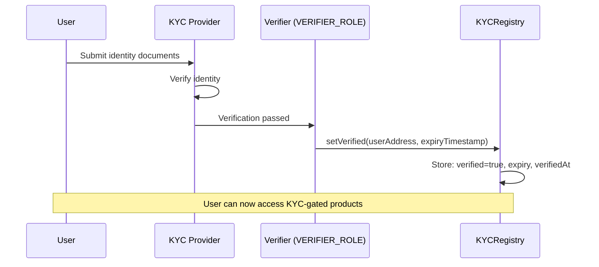
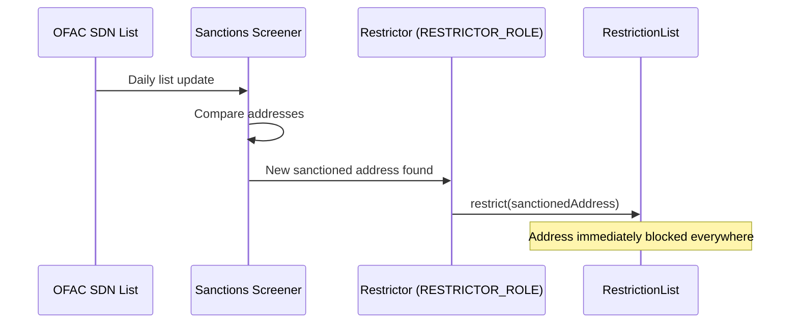

# KYC & AML

How identity verification and anti-money-laundering controls are enforced on-chain.

---

## KYC Registry

The `KYCRegistry` contract maintains an on-chain mapping of verified addresses. Each entry includes:

- **Verified status** — whether the address has passed KYC
- **Expiry timestamp** — when the verification expires (must re-verify after this date)
- **Verification date** — when the KYC was granted

### Verification Flow



### Key operations

| Operation | Role Required | Description |
|-----------|--------------|-------------|
| `setVerified(address, expiry)` | VERIFIER_ROLE | Grant KYC status with expiry |
| `revokeVerification(address)` | VERIFIER_ROLE | Immediately revoke KYC |
| `batchSetVerified(addresses[], expiry)` | VERIFIER_ROLE | Bulk onboarding |
| `isVerified(address)` | Public (view) | Check if address is currently verified and not expired |

### Expiry enforcement

The `isVerified()` function checks both the `verified` flag AND that `block.timestamp < expiry`. An address with expired KYC is treated as unverified — they cannot deposit into vaults or receive restricted token transfers.

!!! warning "Expiry Management"
    KYC verifications must be renewed before expiry. Compliance teams should monitor approaching expirations and prompt re-verification. An expired KYC blocks vault deposits until renewed.

### Batch operations

For onboarding multiple addresses (e.g., an institutional client's sub-accounts):

```
KYCRegistry.batchSetVerified([addr1, addr2, addr3, ...], expiryTimestamp)
```

This is a single transaction that sets all addresses as verified with the same expiry.

---

## Sanctions Screening (RestrictionList)

The `RestrictionList` contract is a global denylist shared across all protocol tokens. When an address is added to the list, it is immediately blocked from:

- Receiving NUSD (stablecoin checks directly)
- Sending NUSD
- Depositing into or withdrawing from vaults (via TransferRestrictions)

### Screening flow



### Key operations

| Operation | Role Required | Description |
|-----------|--------------|-------------|
| `restrict(address)` | RESTRICTOR_ROLE | Add address to denylist |
| `unrestrict(address)` | RESTRICTOR_ROLE | Remove address from denylist |
| `batchRestrict(addresses[])` | RESTRICTOR_ROLE | Bulk deny |
| `isRestricted(address)` | Public (view) | Check if address is on denylist |

### How the denylist is consumed

| Contract | How it checks |
|----------|--------------|
| **NexusStableCoin** | Checks `RestrictionList.isRestricted()` directly in `_update()` for every transfer, mint, and burn |
| **YieldVault** | Checks via `TransferRestrictions.isTransferAllowed()`, which calls RestrictionList internally |

!!! note "Single Source of Truth"
    The RestrictionList is shared — a single `restrict()` call blocks the address across the entire protocol. There is no need to update multiple contracts.

---

## AccreditedInvestor Registry

For products requiring accredited investor status (e.g., structured tranches, certain vault products), a separate `AccreditedInvestor` contract tracks accreditation.

| Operation | Role Required | Description |
|-----------|--------------|-------------|
| `setAccredited(address, bool)` | VERIFIER_ROLE | Set accreditation status |
| `isAccredited(address)` | Public (view) | Check accreditation |

This is a standalone registry. It is not currently enforced at the contract level but is available for integration into future products.

---

## Integration Partners (Planned)

| Integration | Purpose | Status |
|-------------|---------|--------|
| **Persona / Sumsub** | Automated identity verification | Evaluating |
| **Chainalysis KYT** | On-chain address screening | Evaluating |
| **OFAC SDN List** | Free government sanctions data | Available (public data) |
| **Elliptic / TRM Labs** | Advanced blockchain analytics | Future |

!!! note "Current State"
    On the testnet, KYC and sanctions are managed manually by the admin. Automated integrations with third-party providers are planned for production deployment.

---

## Compliance Monitoring Checklist

| Check | Frequency | Action |
|-------|-----------|--------|
| KYC expiry scan | Weekly | Identify addresses with KYC expiring within 30 days; prompt re-verification |
| OFAC SDN update | Daily | Download latest SDN list; compare against active addresses; restrict new matches |
| Denylist reconciliation | Monthly | Compare on-chain RestrictionList with internal compliance database |
| KYC provider reconciliation | Monthly | Verify KYCRegistry matches provider records |
| Accreditation review | Annually | Confirm accredited investor status is still valid |
