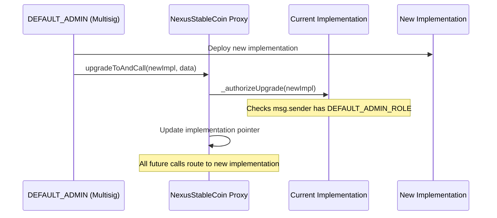

# Regulatory Controls

Emergency mechanisms, upgrade authority, and administrative controls available to the protocol.

---

## Pause Mechanism

The NexusStableCoin contract includes a pause function that immediately halts all token transfers, mints, and burns.

### How it works

| Action | Role Required | Effect |
|--------|--------------|--------|
| `pause()` | PAUSER_ROLE | All NUSD transfers, mints, and burns are blocked |
| `unpause()` | PAUSER_ROLE | Normal operations resume |

When paused:

- No NUSD can be transferred between any addresses
- No new NUSD can be minted (even by the MintController)
- No NUSD can be burned
- Vault deposits and withdrawals involving NUSD are blocked
- Derivative operations requiring NUSD settlement are blocked

!!! warning "System-Wide Impact"
    Pausing NUSD affects the entire protocol since NUSD is the base currency. This should only be used in genuine emergencies: detected exploits, regulatory orders, or critical bugs.

### When to use

| Scenario | Action |
|----------|--------|
| Smart contract exploit detected | Pause immediately, investigate, upgrade if needed |
| Regulatory order to freeze operations | Pause, comply with order, coordinate with legal |
| Critical bug discovered | Pause, deploy fix via UUPS upgrade, unpause |
| Suspicious large transactions | Restrict specific addresses via RestrictionList (do not pause globally) |

---

## Upgrade Authority (UUPS)

The NexusStableCoin is the only upgradeable contract in the protocol. It uses the UUPS (Universal Upgradeable Proxy Standard) pattern.

### How upgrades work



### Upgrade safeguards

| Safeguard | Description |
|-----------|-------------|
| Role-gated | Only `DEFAULT_ADMIN_ROLE` can authorize upgrades |
| Multisig recommended | Admin should be a multisig wallet for production |
| Implementation check | OZ `UUPSUpgradeable` base ensures `_authorizeUpgrade()` exists |
| No proxy admin bypass | UUPS puts upgrade logic in the implementation, not the proxy |
| Storage-compatible | New implementations must maintain storage layout compatibility |

!!! warning "Irreversible"
    Upgrading the implementation is irreversible — there is no built-in downgrade mechanism. Test thoroughly on testnet before upgrading on mainnet.

### Why only the stablecoin is upgradeable

| Contract | Upgradeable | Rationale |
|----------|:-----------:|-----------|
| NexusStableCoin | Yes (UUPS) | Money contract — must be patchable for regulatory compliance and bugs |
| All other contracts | No | Can be replaced by deploying new versions and updating references |

Non-upgradeable contracts are replaced by:

1. Deploying a new version of the contract
2. Updating references in dependent contracts (e.g., changing the TransferRestrictions address on a vault)
3. Migrating state if needed

---

## Emergency Procedures

### Severity 1: Active Exploit

```
1. PAUSER_ROLE holder calls NexusStableCoin.pause()
   → All NUSD transfers halted immediately

2. Assess scope of exploit
   → Which contracts affected?
   → Which user funds at risk?

3. If stablecoin is affected:
   → Deploy patched implementation
   → DEFAULT_ADMIN calls upgradeToAndCall()
   → Unpause after verification

4. If non-upgradeable contract is affected:
   → Deploy replacement contract
   → Update references in dependent contracts
   → Migrate user positions if needed
```

### Severity 2: Regulatory Order

```
1. Assess the order — which addresses/operations are affected?

2. For address-specific freezes:
   → RestrictionList.restrict(address) or batchRestrict([...])
   → AuditLog.log("REGULATORY", "Address frozen per order XYZ", ...)

3. For full operational freeze:
   → NexusStableCoin.pause()
   → AuditLog.log("REGULATORY", "Operations paused per order XYZ", ...)

4. Coordinate with legal counsel before unpausing/unrestricting
```

### Severity 3: Oracle Malfunction

```
1. Assess: Is the oracle posting incorrect values?

2. Revoke REPORTER_ROLE from malfunctioning reporter:
   → NAVOracle.revokeRole(REPORTER_ROLE, reporterAddress)

3. Post corrected NAV from backup reporter:
   → NAVOracle.postNAV(correctedValue, timestamp)

4. Investigate root cause before restoring automated reporting
```

---

## Administrative Operations Summary

| Operation | Contract | Role Required | Reversible |
|-----------|----------|--------------|:----------:|
| Pause all transfers | NexusStableCoin | PAUSER_ROLE | Yes (unpause) |
| Restrict address | RestrictionList | RESTRICTOR_ROLE | Yes (unrestrict) |
| Revoke KYC | KYCRegistry | VERIFIER_ROLE | Yes (re-verify) |
| Upgrade stablecoin | NexusStableCoin | DEFAULT_ADMIN_ROLE | No |
| Change vault oracle | YieldVault | ADMIN_ROLE | Yes |
| Change vault restrictions | YieldVault | ADMIN_ROLE | Yes |
| Update risk parameters | CreditVault | ADMIN_ROLE | Yes |
| Rebalance ETF | ETFWrapper | REBALANCER_ROLE | Yes |
| Reset mint allocation | MintController | ADMIN_ROLE | Yes |

---

## Governance (Planned)

!!! note "Status: Planned"
    On-chain governance via OpenZeppelin Governor + Timelock is designed but not yet deployed. When implemented, it will provide:

- **Governor contract:** Token-weighted voting on protocol changes
- **Timelock controller:** Mandatory delay between proposal approval and execution
- **Proposal lifecycle:** Propose → Vote → Queue → Execute
- Upgrade authorization will flow through the Timelock, adding a mandatory review period before any stablecoin upgrade takes effect
