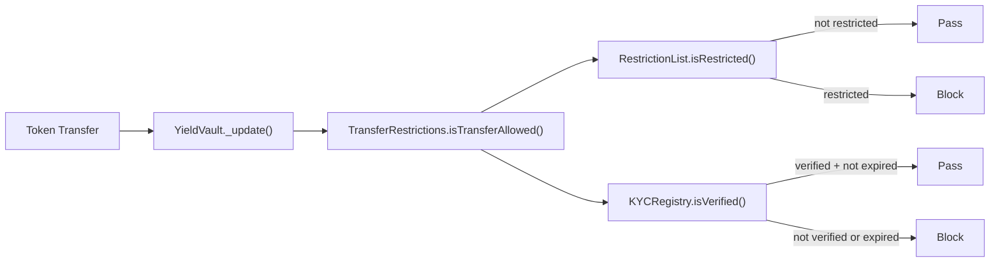
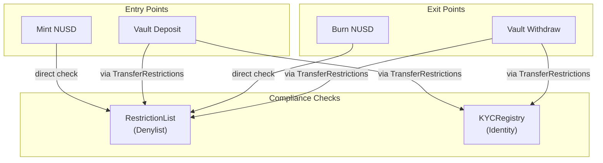

# Transfer Restrictions

How transfers are gated across the protocol, which contracts enforce which checks, and how the modular restriction system works.

---

## Overview

Every token transfer in Nexus Protocol passes through compliance checks. The mechanism differs by contract:

| Token | Restriction Mechanism | Checks Performed |
|-------|----------------------|-----------------|
| **NUSD (NexusStableCoin)** | Direct check in `_update()` | RestrictionList (denylist) |
| **Vault shares (YieldVault)** | Via `TransferRestrictions` module | RestrictionList + KYCRegistry |
| **PT, YT, nxETF** | No direct restrictions | Inherit restrictions from underlying vault operations |

---

## TransferRestrictions Module

The `TransferRestrictions` contract implements the `ITransferRestrictions` interface and provides a modular gate that can be plugged into any token:

```solidity
interface ITransferRestrictions {
    function isTransferAllowed(
        address from,
        address to,
        uint256 amount
    ) external view returns (bool);
}
```

### How it's used



The vault calls `isTransferAllowed(from, to, amount)` on every share transfer (including mints and redeems). The function returns `true` only if:

1. Neither `from` nor `to` is on the RestrictionList
2. If KYC is required: both `from` and `to` are verified in the KYCRegistry (with valid, non-expired status)

### Special cases

| Transfer Type | `from` | `to` | Notes |
|--------------|--------|------|-------|
| **Mint (deposit)** | `address(0)` | receiver | Only `to` is checked against restrictions |
| **Burn (redeem)** | owner | `address(0)` | Only `from` is checked |
| **Regular transfer** | sender | recipient | Both are checked |

### Configurable checks

The `DEFAULT_ADMIN_ROLE` holder on `TransferRestrictions` can:

- Update the RestrictionList reference
- Update the KYCRegistry reference
- Toggle KYC requirement on/off via `setKYCRequired(bool)`

!!! note "KYC Toggle"
    KYC enforcement can be enabled or disabled per `TransferRestrictions` instance. This allows some vaults to require KYC while others operate with denylist-only restrictions.

---

## Stablecoin Restrictions

NUSD checks the RestrictionList directly in its `_update()` function — it does NOT use the `TransferRestrictions` module. This is by design:

- The stablecoin is the most widely transferred token and needs the simplest, fastest check
- Denylist enforcement is sufficient for basic transfers
- KYC is enforced at the vault level, not the stablecoin level

### How NUSD restrictions work

Every call to `transfer()`, `transferFrom()`, `mint()`, or `burn()` triggers `_update()`, which:

1. Checks `restrictionList.isRestricted(from)` — blocks if true
2. Checks `restrictionList.isRestricted(to)` — blocks if true
3. Reverts with `AddressRestricted(account)` if either check fails

!!! warning "Immediate Effect"
    When an address is added to the RestrictionList, it is **immediately** blocked from all NUSD transfers. There is no grace period. Ensure compliance decisions are final before restricting an address.

---

## Vault Restrictions

YieldVault uses the modular `TransferRestrictions` approach:

1. Admin sets the `TransferRestrictions` contract on the vault via `setTransferRestrictions(address)`
2. On every share transfer, the vault calls `transferRestrictions.isTransferAllowed(from, to, amount)`
3. If the function returns `false`, the vault reverts with `TransferRestricted(from, to, amount)`

### Configuring vault restrictions

```
// Admin sets transfer restrictions module
yieldVault.setTransferRestrictions(transferRestrictionsAddress)

// Enable KYC requirement
transferRestrictions.setKYCRequired(true)
```

If `transferRestrictions` is set to `address(0)`, no restrictions are enforced (open access).

---

## Derivatives Transfer Behavior

| Derivative | Transfer Restrictions | Rationale |
|-----------|----------------------|-----------|
| **PrincipalToken (PT)** | None on token transfers | Compliance enforced at split/redeem via vault |
| **YieldToken (YT)** | None on token transfers | Compliance enforced at split/redeem via vault |
| **CreditVault positions** | Not transferable | Positions are per-address, cannot be moved |
| **nxETF (ETFWrapper)** | None on token transfers | Compliance enforced at deposit/withdraw via vault |

!!! note "Design Decision"
    Derivative tokens are freely transferable once created. Compliance checks are enforced at the point of entry (vault deposit) and exit (vault withdrawal), not on secondary transfers. This enables derivative tokens to be traded on secondary markets while maintaining compliance at the protocol boundary.

---

## Restriction Flow Summary


