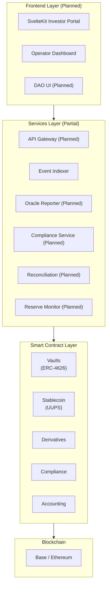
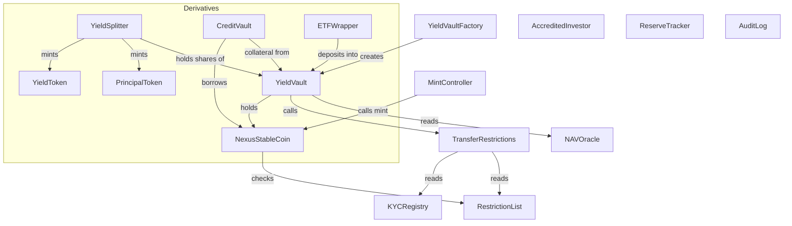
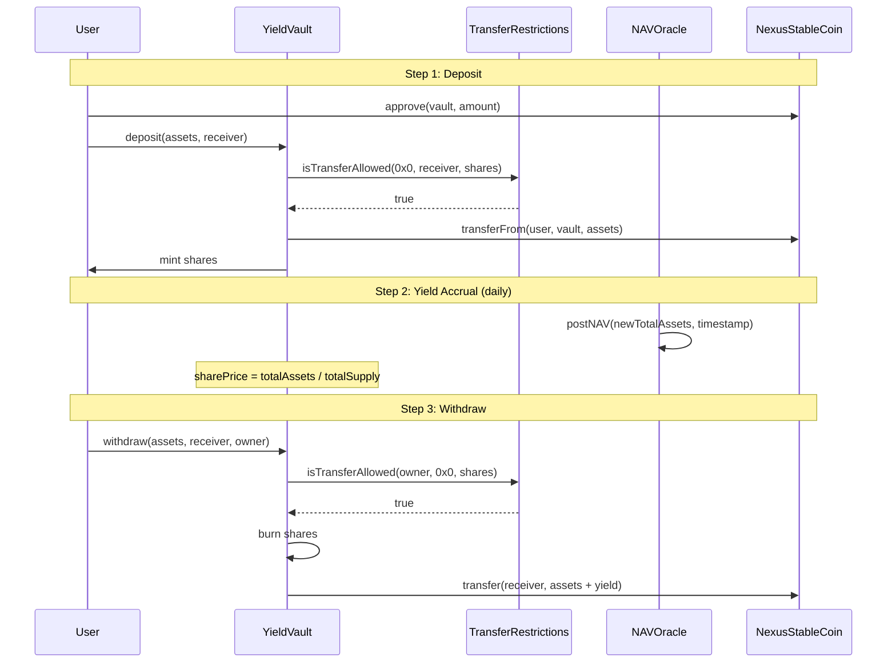
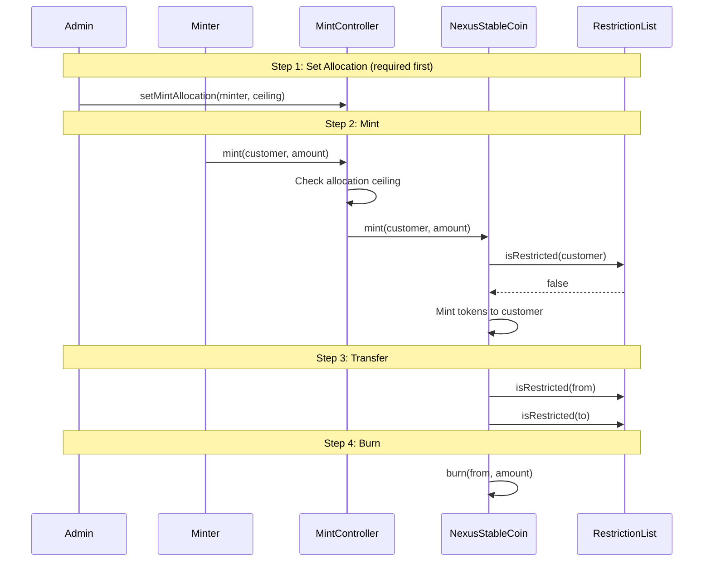
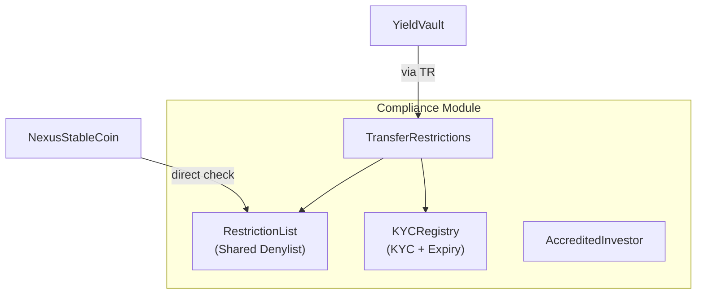
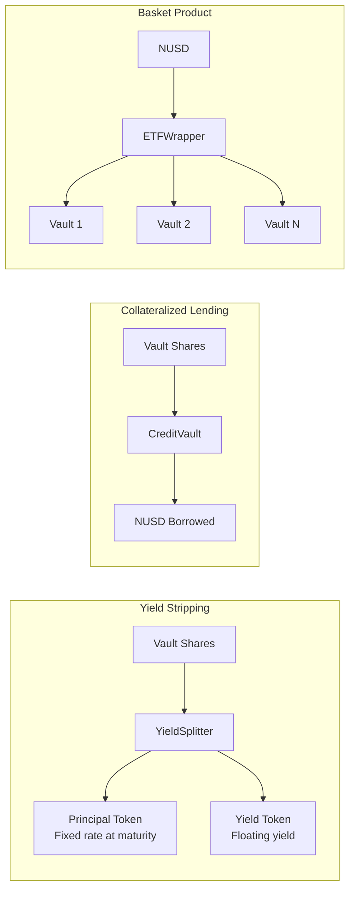

# Architecture

System layers, contract relationships, and data flow diagrams.

---

## System Layers

---

## Contract Dependency Graph

---

## Vault Flow (Deposit to Yield to Withdraw)

---

## Stablecoin Flow (Mint to Transfer to Burn)

---

## Compliance Architecture

- **RestrictionList** is shared across all tokens. One `restrict()` call blocks an address everywhere.
- **TransferRestrictions** composes denylist + KYC checks. Plugged into vaults.
- **NexusStableCoin** checks the denylist directly (does not use TransferRestrictions).
- **AccreditedInvestor** is standalone, available for future product gating.

---

## Derivatives Architecture

All derivatives consume ERC-4626 vault shares as their underlying collateral. They never hold raw NUSD or external tokens directly.

---

## Multi-Chain Strategy

| Chain | Purpose | Status |
|-------|---------|--------|
| **Base Sepolia** | Development and testing | All contracts deployed |
| **Base Mainnet** | Primary deployment — low gas, fast finality | Planned |
| **Ethereum Mainnet** | Canonical stablecoin — institutional credibility | Planned |
| **Arbitrum** | DeFi composability — bridge vault deposits | Planned |

---

## Off-Chain Services

| Service | Purpose | Status |
|---------|---------|--------|
| API Gateway | REST + WebSocket + GraphQL | Planned (NestJS) |
| Event Indexer | Index on-chain events for queries | Running |
| Oracle Reporter | Fetch prices, post NAV on-chain | Planned |
| Compliance Service | Sanctions screening, denylist sync | Planned |
| Reserve Monitor | Track reserve ratio, alert on discrepancy | Planned |
| Audit Reporter | Generate attestation reports | Planned |
| Reconciliation | Compare on-chain vs oracle state | Planned |
