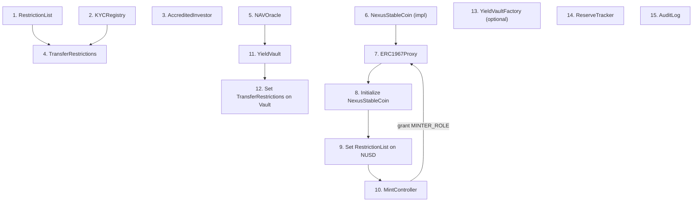

# Deployment Guide

Deploy script walkthrough, contract wiring order, gas estimates, and multi-chain migration plan.

---

## Deployment Order

Contracts must be deployed and wired in a specific order due to cross-contract dependencies.

### Step-by-step

| Step | Contract | Dependencies | Notes |
|------|----------|-------------|-------|
| 1 | RestrictionList | None | Standalone |
| 2 | KYCRegistry | None | Standalone |
| 3 | AccreditedInvestor | None | Standalone |
| 4 | TransferRestrictions | RestrictionList, KYCRegistry | Pass addresses to constructor |
| 5 | NAVOracle | None | Standalone |
| 6 | NexusStableCoin (implementation) | None | Deploy implementation only |
| 7 | ERC1967Proxy | NexusStableCoin impl | UUPS proxy pointing to impl |
| 8 | Initialize NexusStableCoin | Proxy deployed | Call `initialize()` via proxy |
| 9 | Set RestrictionList on NUSD | RestrictionList, NUSD proxy | `setRestrictionList(address)` |
| 10 | MintController | NUSD proxy | Pass NUSD address to constructor |
| 11 | Grant MINTER_ROLE | MintController, NUSD | `grantRole(MINTER_ROLE, mintController)` on NUSD |
| 12 | YieldVault | NUSD, NAVOracle | Pass deposit token + oracle |
| 13 | Set TransferRestrictions | YieldVault, TransferRestrictions | `setTransferRestrictions(address)` |
| 14 | YieldVaultFactory | Optional | For creating new vaults |
| 15 | ReserveTracker | None | Standalone |
| 16 | AuditLog | None | Standalone |

### Post-deployment role grants

| On Contract | Role | Grant To |
|-------------|------|----------|
| NAVOracle | REPORTER_ROLE | Oracle reporter address |
| KYCRegistry | VERIFIER_ROLE | KYC service address |
| RestrictionList | RESTRICTOR_ROLE | Compliance service address |
| MintController | ALLOCATOR_ROLE | Treasury operations address |
| ReserveTracker | REPORTER_ROLE | Reserve reporter address |
| AuditLog | LOGGER_ROLE | All contracts that should log |

!!! warning "Set MintController Allocation"
    After deploying MintController and granting MINTER_ROLE on NUSD, you MUST call `setMintAllocation(minterAddress, ceiling)` for every address that will mint — including the deployer. Without this step, all mint attempts revert.

---

## Gas Estimates (Base Sepolia)

| Contract | Estimated Gas |
|----------|:------------:|
| Small contracts (RestrictionList, KYCRegistry, etc.) | 1,000,000 |
| NexusStableCoin implementation | 3,000,000 |
| ERC1967Proxy (UUPS init) | 1,000,000 |
| YieldVault, PrincipalToken, YieldToken | 2,000,000 |
| YieldSplitter, CreditVault, ETFWrapper | 2,000,000 |
| YieldVaultFactory | 5,000,000 |
| `createVault()` call | 5,000,000 |

---

## RPC Selection (Base Sepolia)

| RPC | Small Contracts | Large Contracts | Notes |
|-----|:-:|:-:|-------|
| `https://base-sepolia.drpc.org` | Works | Fails (HTTP 403) | Use for small deploys and reads |
| `https://base-sepolia-rpc.publicnode.com` | Works | Works | Use for large contract deploys |
| `https://sepolia.base.org` | Fails | Fails | Avoid for deploy transactions |

!!! note "Nonce Management"
    drpc and publicnode don't always serve the same pending nonce. After failed deploys, check `eth_getTransactionCount("latest")` and wait until confirmed == pending before retrying.

---

## Derivatives Deployment

Derivatives are deployed after core protocol contracts:

| Step | Contract | Dependencies |
|------|----------|-------------|
| 1 | PrincipalToken | NUSD address, maturity timestamp |
| 2 | YieldToken | Maturity timestamp |
| 3 | YieldSplitter | YieldVault, PT, YT, maturity |
| 4 | Grant MINTER_ROLE on PT to YieldSplitter | |
| 5 | Grant MINTER_ROLE on YT to YieldSplitter | |
| 6 | CreditVault | YieldVault, NUSD |
| 7 | ETFWrapper | NUSD, vault allocations |

---

## Multi-Chain Migration Plan

### Phase 1: Base Sepolia (Current)

All contracts deployed for development and testing. Deployer holds all roles.

### Phase 2: Base Mainnet

1. Deploy all contracts using production deploy scripts
2. Transfer DEFAULT_ADMIN_ROLE to multisig wallets
3. Grant operational roles to service addresses
4. Set mint allocations for authorized minters
5. Seed NAV oracle with initial values
6. Verify all contracts on Basescan

### Phase 3: Ethereum Mainnet

1. Deploy NexusStableCoin (canonical stablecoin) on Ethereum
2. Deploy compliance contracts (RestrictionList, KYCRegistry, TransferRestrictions)
3. Configure cross-chain messaging for reserve tracking (future)

### Phase 4: Arbitrum

1. Deploy vault contracts for DeFi composability
2. Bridge NUSD from Base via canonical bridge
3. Deploy derivative contracts as needed

---

## Current Testnet Addresses

All contracts deployed on Base Sepolia (Chain ID 84532). Deployer/admin: `0x41521c37dB02956185437C4e2461261A321073E1`.

| Contract | Address |
|----------|---------|
| NexusStableCoin (proxy) | `0x82671ab3119c8f73acc0ee43c6b167b46b948141` |
| NexusStableCoin (impl) | `0x417b8aa2092298ebc23086571a14c4802984ee9b` |
| MintController | `0xee9b15f35ea7a9920c38ac1aacd5af265931886a` |
| NAVOracle | `0x28dc5ccc6a97675b7def7b4c4179b85127b698f3` |
| YieldVaultFactory | `0x7802ee123ef4a834987f69ed020da67881ce86b0` |
| YieldVault (nxTREASURY) | `0x6671D7937ae8b9120A673724FD26CF06e61b4F67` |
| ReserveTracker | `0x9e9abd3734140eb7de220e190cc63436405ab219` |
| AuditLog | `0xbf2f6169366b4971b6a1918af34b13f04ad1cc2c` |
| RestrictionList | `0xea1ea3239ac1731acb6cffbe666fa6ff55e5a669` |
| KYCRegistry | `0xadac3b940503626d5c72e202bf165c572d3ea11a` |
| AccreditedInvestor | `0xd30fc13df30b31bc6d4c5fe7e3ee3877093fcf31` |
| TransferRestrictions | `0xbaa4050fef138f3f9dc19373db6b57860059c5a9` |
| MockPriceFeed | `0xf6752cf9665db80a396073c66ac8df4b4b5327be` |
| ETHSwapGateway | `0xd4ffdd233197a0d24be3cd882c8a6145ffe5f57b` |
