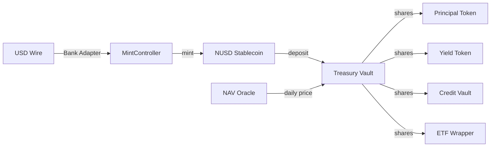

# Getting Started

A quick orientation to Nexus Protocol for all roles.

---

## Core Concepts

### NUSD — The Stablecoin

NUSD is a USD-pegged stablecoin with 6 decimals (matching USDC convention). It is the base currency for all protocol operations: vault deposits, derivative collateral, and lending.

- Minted through a **MintController** that enforces per-minter ceilings
- Transferable only between non-restricted, KYC-verified addresses
- Pausable by a designated PAUSER in emergencies
- Upgradeable via UUPS proxy for regulatory changes

### Vaults — Tokenized Yield

Treasury vaults accept NUSD deposits and issue ERC-4626 shares (e.g., nxTREASURY). Share price increases daily as the NAV oracle reports yield from underlying T-bill positions.

**Example:** Deposit $100,000 NUSD into the Treasury Vault. After one year at 4.5% APY, your shares are worth $104,500 NUSD.

### Derivatives — Structured Products

Built on top of vaults, derivatives allow institutions to customize their risk/return profile:

- **Principal Tokens (PT):** Fixed-rate — lock in a yield at maturity
- **Yield Tokens (YT):** Floating-rate — speculate on interest rate movements
- **Credit Vault:** Borrow NUSD against vault shares as collateral
- **ETF Wrapper:** Diversified exposure across multiple vaults in a single token
- **Tranches:** Senior (capital-protected) and junior (yield-enhanced) positions *(Planned)*

---

## How the Pieces Fit Together

1. **Fiat enters** via banking partner wire, triggering NUSD minting
2. **NUSD is deposited** into yield vaults for tokenized treasury exposure
3. **Vault shares** can be held directly or used in derivative products
4. **NAV oracle** posts daily asset values, driving share price appreciation

---

## Key Numbers

| Parameter | Value |
|-----------|-------|
| NUSD decimals | 6 (1 NUSD = 1,000,000 base units) |
| Vault standard | ERC-4626 |
| Credit Vault collateral ratio | 150% |
| Credit Vault liquidation threshold | 120% LTV |
| Credit Vault borrow rate | 5% APY |
| NAV update frequency | Daily |
| Target yield (Treasury Vault) | ~4.5% APY (T-bill benchmark) |

---

## Role Quick Reference

| If you are a... | You care about... | Start reading... |
|-----------------|-------------------|-----------------|
| Sales desk | Products, pricing, client pitches | [Product Catalog](sales-trading/products.md) |
| Trader | Yield strategies, PT/YT mechanics | [Yield Strategies](sales-trading/yield-strategies.md) |
| Compliance officer | KYC, sanctions, access control | [Access Control](compliance/access-control.md) |
| Developer | Contracts, APIs, deployment | [Architecture](developers/architecture.md) |
| Legal counsel | Token classification, risks, governance | [Token Classification](legal-regulatory/token-classification.md) |
| Auditor | Reserve tracking, audit trail | [Audit Trail](compliance/audit-trail.md) |
