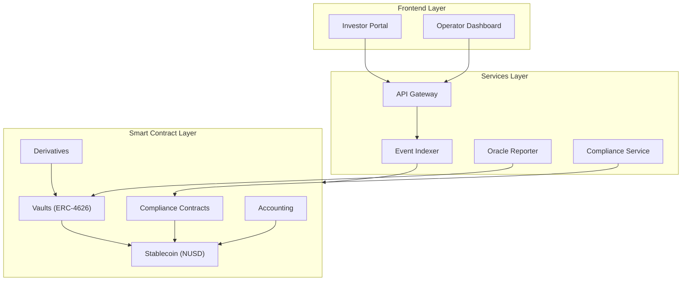

# Nexus Protocol

**Institutional-grade digital asset infrastructure for tokenized treasuries, stablecoin issuance, and structured fixed-income products.**

---

## What Is Nexus Protocol?

Nexus Protocol is a smart contract platform that brings traditional fixed-income products on-chain. It enables institutions to:

- **Issue and manage a fully-backed stablecoin (NUSD)** with role-based minting, burning, and compliance controls
- **Create tokenized treasury vaults** that hold T-bills and money market instruments, returning yield to depositors via the ERC-4626 standard
- **Offer structured derivatives** including principal/yield stripping, tranched products, collateralized lending, and diversified basket tokens

All operations are governed by on-chain access control, KYC/AML enforcement, sanctions screening, and an immutable audit trail.

---

## Why Nexus Protocol?

| Challenge | How Nexus Solves It |
|-----------|-------------------|
| T-bill yield is inaccessible on-chain | ERC-4626 vaults tokenize treasury positions with daily NAV updates |
| Stablecoin compliance is opaque | Role-separated minting, denylist enforcement, and on-chain audit log |
| Fixed income products lack composability | PT/YT splitting, senior/junior tranches, and ETF wrappers compose on top of vaults |
| Institutional controls are absent in DeFi | KYC registry, accredited investor checks, and transfer restrictions gate every operation |

---

## Protocol Architecture

---

## Product Suite at a Glance

| Product | Description | Status |
|---------|-------------|--------|
| **NUSD Stablecoin** | 1:1 USD-backed, 6-decimal ERC-20 with pause, denylist, and UUPS upgradeability | Live on Base Sepolia |
| **Treasury Vault (nxTREASURY)** | ERC-4626 vault backed by T-bill yield via NAV oracle | Live on Base Sepolia |
| **ETH Swap Gateway** | Buy/sell NUSD and vault shares directly with ETH | Live on Base Sepolia |
| **Principal Token (PT)** | Fixed-rate claim redeemable 1:1 at maturity | Live on Base Sepolia |
| **Yield Token (YT)** | Floating-rate token capturing all vault yield until maturity | Live on Base Sepolia |
| **Credit Vault** | Borrow NUSD against vault share collateral (150% collateral ratio) | Live on Base Sepolia |
| **ETF Wrapper (nxETF)** | Basket token with weighted allocation across multiple vaults | Live on Base Sepolia |
| **Structured Tranches** | Senior/junior tranche products with waterfall payouts | (Planned) |
| **Governance** | On-chain Governor + Timelock for protocol upgrades | (Planned) |

---

## Target Chains

| Chain | Purpose | Status |
|-------|---------|--------|
| **Base Sepolia** | Development and testing | All contracts deployed |
| **Base Mainnet** | Primary production deployment | Planned |
| **Ethereum Mainnet** | Canonical stablecoin for institutional credibility | Planned |
| **Arbitrum** | DeFi composability and bridged vault deposits | Planned |

---

## Documentation

### Sales & Trading
- [Overview](sales-trading/index.md)
- [Product Catalog](sales-trading/products.md)
- [Yield Strategies](sales-trading/yield-strategies.md)
- [Pricing & NAV](sales-trading/pricing.md)
- [Client Pitches](sales-trading/client-pitches.md)

### Compliance
- [Overview](compliance/index.md)
- [Access Control & Roles](compliance/access-control.md)
- [KYC & AML](compliance/kyc-aml.md)
- [Transfer Restrictions](compliance/transfer-restrictions.md)
- [Audit Trail](compliance/audit-trail.md)
- [Regulatory Controls](compliance/regulatory-controls.md)

### Developers
- [Overview](developers/index.md)
- [Architecture](developers/architecture.md)
- [Contract Reference](developers/contracts-reference.md)
- [Deployment Guide](developers/deployment-guide.md)
- [Integration Guide](developers/integration-guide.md)
- [Testing](developers/testing.md)
- [API Reference](developers/api-reference.md)

### Legal & Regulatory
- [Overview](legal-regulatory/index.md)
- [Token Classification](legal-regulatory/token-classification.md)
- [Smart Contract Risks](legal-regulatory/smart-contract-risks.md)
- [Reserve Transparency](legal-regulatory/reserve-transparency.md)
- [Governance](legal-regulatory/governance.md)
