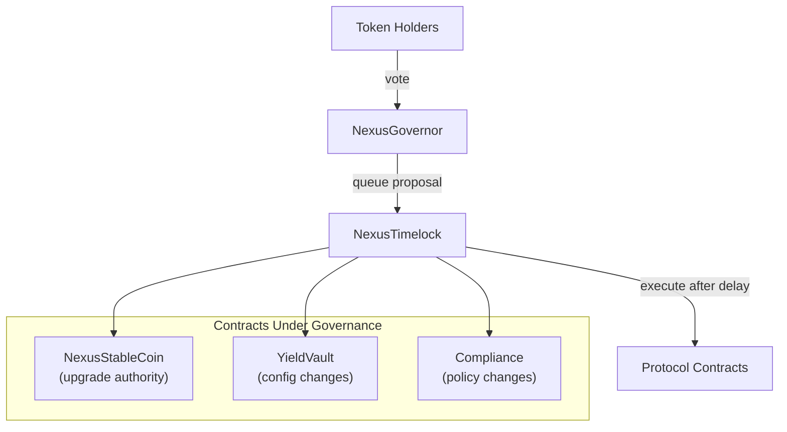
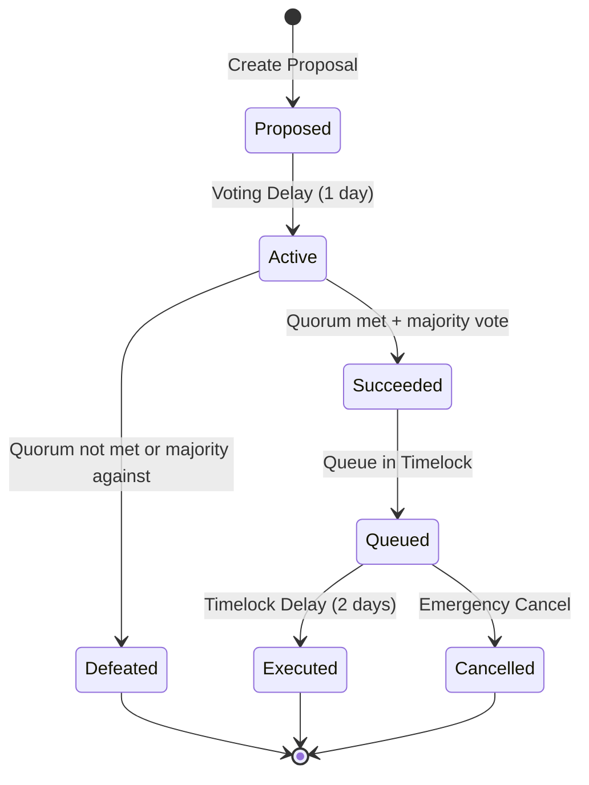

# Governance

On-chain governance design using OpenZeppelin Governor and Timelock contracts, the proposal lifecycle, and how upgrade authorization flows through governance.

!!! note "Status: Planned"
    The governance module (NexusGovernor + NexusTimelock) is designed but not yet deployed. This document describes the target architecture.

---

## Governance Architecture

---

## Components

### NexusGovernor

An OpenZeppelin Governor contract that manages proposals and voting.

**Key parameters (target):**

| Parameter | Value | Description |
|-----------|-------|-------------|
| Voting delay | 1 day | Time between proposal creation and voting start |
| Voting period | 5 days | Duration of the voting window |
| Proposal threshold | TBD | Minimum tokens to create a proposal |
| Quorum | TBD | Minimum votes for proposal to pass |

### NexusTimelock

An OpenZeppelin TimelockController that enforces a delay between proposal approval and execution.

**Key roles:**

| Role | Holder | Purpose |
|------|--------|---------|
| PROPOSER_ROLE | NexusGovernor | Only the governor can queue proposals |
| EXECUTOR_ROLE | Open (anyone) | Anyone can execute a queued proposal after the delay |
| CANCELLER_ROLE | Emergency multisig | Can cancel a queued proposal before execution |
| DEFAULT_ADMIN_ROLE | Timelock itself | Self-administering |

**Timelock delay (target):** 2 days minimum — provides a window for the community to review queued actions before execution.

---

## Proposal Lifecycle

1. **Proposed:** A token holder with sufficient tokens creates a proposal
2. **Active:** After the voting delay, token holders vote for/against/abstain
3. **Succeeded:** If quorum is met and majority votes in favor
4. **Queued:** The proposal is queued in the Timelock with a mandatory delay
5. **Executed:** After the delay, anyone can trigger execution
6. **Cancelled:** The emergency multisig can cancel before execution

---

## Governance-Controlled Actions

### Stablecoin upgrades

The most critical governance action. When governance is active:

1. A proposal is created to upgrade NexusStableCoin to a new implementation
2. Token holders vote during the voting period
3. If approved, the upgrade is queued in the Timelock
4. After the timelock delay, the upgrade can be executed
5. The Timelock calls `upgradeToAndCall()` on the proxy

This ensures no single party can unilaterally upgrade the stablecoin — it requires community approval and a mandatory review period.

### Protocol configuration changes

| Change | Current Authority | Governance Authority |
|--------|------------------|---------------------|
| Stablecoin upgrade | DEFAULT_ADMIN (multisig) | Governor → Timelock |
| Oracle address update | ADMIN_ROLE | Governor → Timelock |
| Risk parameter changes | ADMIN_ROLE | Governor → Timelock |
| Transfer restrictions config | DEFAULT_ADMIN | Governor → Timelock |
| Role grants/revocations | DEFAULT_ADMIN | Governor → Timelock |

### Emergency overrides

Some actions must bypass the governance delay for safety:

| Emergency Action | Mechanism |
|-----------------|-----------|
| Pause stablecoin | PAUSER_ROLE (emergency multisig) — no governance delay |
| Restrict address (sanctions) | RESTRICTOR_ROLE — no governance delay |
| Revoke KYC | VERIFIER_ROLE — no governance delay |
| Cancel queued proposal | CANCELLER_ROLE — immediate |

---

## Governance Token

!!! note "Not Yet Defined"
    The governance token has not been designed. Options under consideration:

| Option | Description | Trade-offs |
|--------|-------------|------------|
| Separate governance token | Dedicated ERC-20 for voting | Clean separation; requires distribution mechanism |
| Vault share voting | nxTREASURY shares used for voting | Aligns governance with economic interest; complex for multi-vault |
| Staked governance token | Governance token with staking requirement | Filters for committed participants; adds complexity |

---

## Migration to Governance

The transition from multisig-controlled to governance-controlled will follow this sequence:

1. **Deploy governance token** and distribute to stakeholders
2. **Deploy NexusGovernor** configured with voting parameters
3. **Deploy NexusTimelock** with appropriate delay
4. **Grant PROPOSER_ROLE** on Timelock to Governor
5. **Transfer DEFAULT_ADMIN_ROLE** on critical contracts from multisig to Timelock
6. **Retain emergency roles** (PAUSER, RESTRICTOR) on separate multisig
7. **Test governance flow** on testnet before mainnet migration

!!! warning "Irreversible"
    Transferring admin authority to the Timelock is effectively irreversible — the only way to change protocol parameters after this point is through governance proposals. Ensure the governance mechanism is thoroughly tested before migration.
