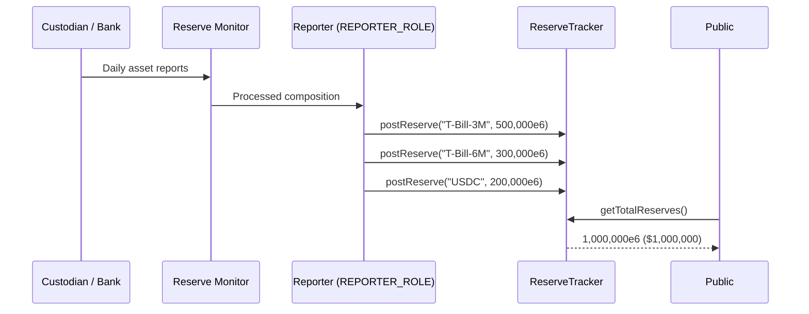
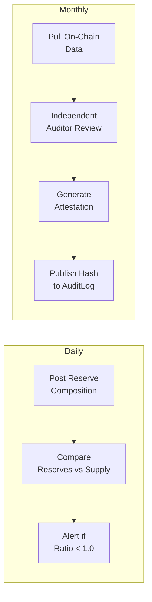

# Reserve Transparency

How Nexus Protocol tracks reserves on-chain, the proof-of-reserves workflow, and the planned reconciliation and audit process.

---

## On-Chain Reserve Tracking

The `ReserveTracker` contract provides a transparent, append-only record of reserve composition. Authorized reporters post daily entries that anyone can query.

### What is tracked

Each reserve entry contains:

| Field | Description | Example |
|-------|-------------|---------|
| Asset type | Human-readable identifier | "T-Bill-3M", "T-Bill-6M", "USDC" |
| Amount | Reserve amount in base units (6 decimals) | 500,000,000,000 (= $500,000) |
| Timestamp | When the entry was posted | Block timestamp |
| Reporter | Who posted the entry | Reporter address |

### How it works



---

## Reserve Ratio

The reserve ratio is the relationship between total reserves and total NUSD outstanding:

```
reserveRatio = ReserveTracker.getTotalReserves() / NexusStableCoin.totalSupply()
```

| Ratio | Interpretation |
|-------|---------------|
| >= 1.0 | Fully collateralized — reserves meet or exceed outstanding NUSD |
| 0.9 - 1.0 | Under-collateralized — reserves are below outstanding NUSD |
| < 0.9 | Critical — significant reserve shortfall |

!!! warning "Self-Reported Data"
    Reserve data posted to the ReserveTracker is self-reported by the REPORTER_ROLE holder. Until independent attestation is in place, these figures should be treated as unaudited operator claims.

---

## Proof-of-Reserves Workflow

### Daily operations

1. **Custodian reports** asset holdings to the reserve monitor service
2. **Reserve monitor** processes the data and posts it to ReserveTracker on-chain
3. **Automated check** compares total reserves against NUSD total supply
4. **Alert** if reserve ratio drops below threshold

### Monthly attestation

1. **Audit reporter** pulls all on-chain data for the reporting period:
    - Reserve composition from ReserveTracker events
    - NUSD supply from stablecoin contract
    - NAV history from NAVOracle events
    - All AuditLog entries
2. **Independent auditor** verifies the data against custodian records
3. **Attestation report** is generated with findings
4. **Report hash** is published on-chain via AuditLog:
    ```
    AuditLog.log("AUDIT", "Monthly attestation - April 2026", reportHash)
    ```
5. **Public verification:** Anyone can compare the on-chain hash with the published report

### Flow diagram



---

## What Auditors Can Verify

All of the following data is available on-chain and cannot be altered:

| Data Point | Source | How to Query |
|-----------|--------|-------------|
| Reserve composition over time | ReserveTracker events | Filter `ReservePosted` events |
| NUSD total supply at any block | NexusStableCoin contract | `totalSupply()` at historical block |
| NAV history | NAVOracle events | Filter `NAVUpdated` events |
| All minting events | NexusStableCoin Transfer events | Filter `Transfer` from `address(0)` |
| All burning events | NexusStableCoin Transfer events | Filter `Transfer` to `address(0)` |
| Mint allocations and usage | MintController events | Filter `AllocationSet`, `MintExecuted` |
| Compliance actions | AuditLog events | Filter by category |
| KYC grants/revocations | KYCRegistry events | Filter `KYCVerified`, `KYCRevoked` |
| Sanctions list changes | RestrictionList events | Filter `AddressRestricted`, `AddressUnrestricted` |

---

## Planned Enhancements

| Enhancement | Description | Timeline |
|-------------|-------------|----------|
| **Reconciliation service** | Automated comparison of on-chain reserves vs custodian API | Planned (Phase 3) |
| **Independent auditor** | Monthly attestation by Armanino, Withum, or similar firm | Planned (Month 6+) |
| **Real-time reserve feed** | Custodian API integration for continuous reserve updates | Planned (with banking partner) |
| **Cross-chain reserve tracking** | Track reserves across multiple chain deployments | Future |
| **Automated reserve alerts** | On-chain or off-chain alerts when ratio drops below threshold | Planned (Phase 3) |

---

## Audit Partners Under Evaluation

| Firm | Specialization | Status |
|------|---------------|--------|
| Armanino | CPA firm with crypto attestation practice | Evaluating |
| WithumSmith+Brown | CPA firm with crypto audit practice | Evaluating |
| Grant Thornton | Big 4-adjacent, Circle's auditor | Future consideration |
| KPMG / Deloitte / PwC / EY | Big 4 | Future (at scale) |
