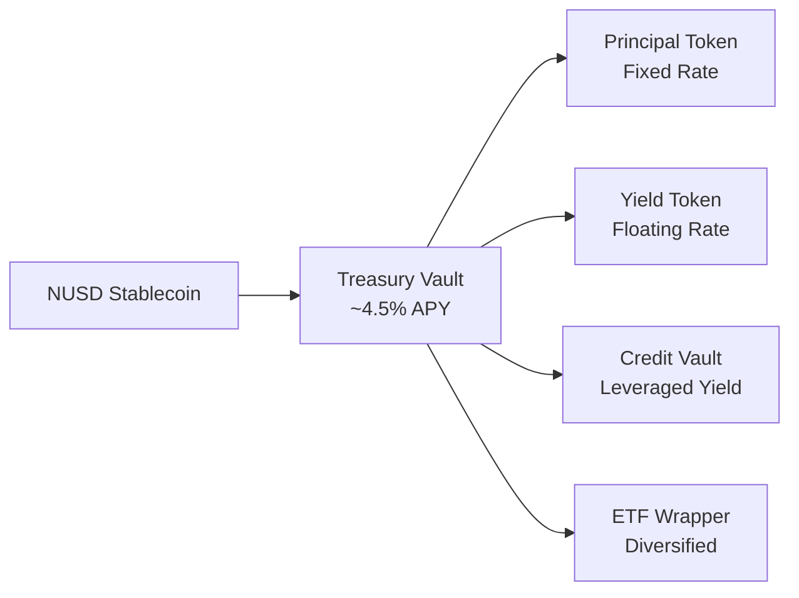

# Sales & Trading Overview

This section is for front-office teams — sales desks, traders, and portfolio managers — who need to understand what Nexus Protocol products do, how they generate returns, and how to position them for institutional clients.

---

## What We Offer

Nexus Protocol provides on-chain fixed-income infrastructure. Think of it as a digital equivalent of T-bill funds, structured notes, and repo facilities — all operating on blockchain rails with real-time settlement.

---

## Product Summary

| Product | Traditional Equivalent | Target Client | Risk Level |
|---------|----------------------|---------------|------------|
| **Treasury Vault** | T-bill money market fund | Corporate treasury, pension fund | Low |
| **Principal Token** | Zero-coupon T-bill | Fixed income desk, insurance | Very Low |
| **Yield Token** | Interest rate swap (floating leg) | Trading desk, hedge fund | Medium |
| **Credit Vault** | Repo / securities lending | Hedge fund, proprietary trading | Medium-High |
| **ETF Wrapper** | Bond index ETF | Family office, wealth manager | Low |
| **Tranches** | CMO / CLO tranches | Insurance (senior), hedge fund (junior) | Varies |

---

## Quick Links

- [Full Product Catalog](products.md) — detailed specs for every product
- [Yield Strategies](yield-strategies.md) — how to construct positions for different objectives
- [Pricing & NAV](pricing.md) — how prices are determined and updated
- [Client Pitches](client-pitches.md) — talking points by client type
