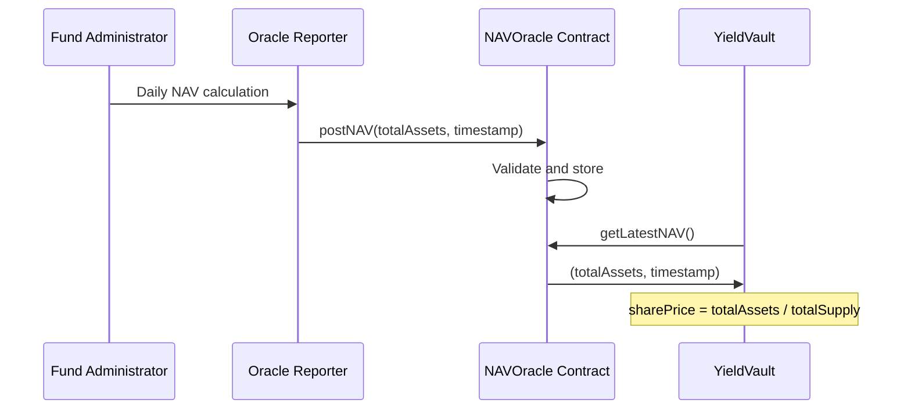
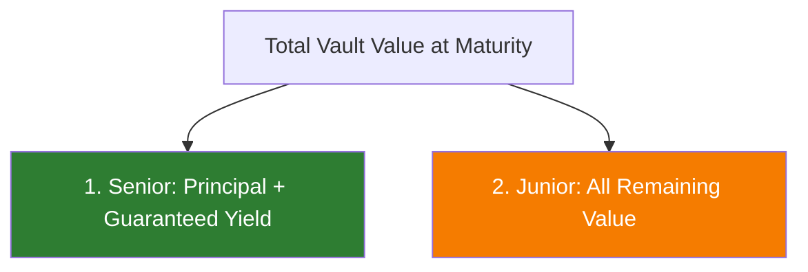

# Pricing & NAV

How prices are determined, updated, and consumed across all Nexus Protocol products.

---

## NAV Oracle

The NAV Oracle is the pricing backbone of the protocol. It determines how much the underlying assets in a vault are worth, which directly sets the share price.

### How it works



1. A fund administrator calculates the total value of underlying assets (T-bills, money market instruments)
2. An authorized oracle reporter posts the NAV to the on-chain `NAVOracle` contract
3. The vault reads the latest NAV to determine `totalAssets()`
4. Share price is derived: `sharePrice = totalAssets / totalSupply`

### Update frequency

NAV is updated **daily**, matching T-bill settlement conventions. Each update must have a timestamp greater than or equal to the previous entry.

### Fallback behavior

If the oracle has no entries, the vault falls back to its actual deposit-token balance. This ensures the vault functions correctly during initial setup.

---

## Vault Share Pricing

### Formula

```
sharePrice = totalAssets / totalSupply
```

Where:

- `totalAssets` = latest NAV oracle value (or vault token balance if no oracle entries)
- `totalSupply` = total vault shares in circulation

### Deposit pricing

When depositing NUSD:

```
sharesReceived = depositAmount * totalSupply / totalAssets
```

**Example:** Vault has $10,000,000 in assets and 9,800,000 shares outstanding.

- Share price: $10,000,000 / 9,800,000 = $1.0204
- Deposit $100,000 NUSD → receive 100,000 / 1.0204 = 98,000 shares

### Withdrawal pricing

When withdrawing NUSD:

```
assetsReceived = sharesRedeemed * totalAssets / totalSupply
```

**Example:** Same vault, redeem 98,000 shares.

- Assets received: 98,000 * $1.0204 = $100,000 NUSD

---

## Principal Token Pricing

PT trades at a **discount to face value** before maturity. The discount reflects the time value of money — the implied yield to maturity.

### Implied yield calculation

```
impliedYield = (faceValue / currentPrice - 1) * (365 / daysToMaturity)
```

**Example:**

- PT face value: $1.000000
- Current market price: $0.978000
- Days to maturity: 180

```
impliedYield = (1.0 / 0.978 - 1) * (365 / 180) = 4.56% annualized
```

### Price behavior

| Market condition | PT price direction | Implied yield direction |
|-----------------|-------------------|----------------------|
| Rates rise | PT price falls | Implied yield rises |
| Rates fall | PT price rises | Implied yield falls |
| Approaching maturity | PT price approaches $1.00 | Spread compresses |

---

## Yield Token Pricing

YT value is driven by expected future yield from the underlying vault position.

### Theoretical value

```
ytValue = expectedYieldPerUnit * remainingTimeToMaturity
```

**Example:**

- Vault APY: 4.5%
- Time to maturity: 6 months
- YT theoretical value per unit: 4.5% * (6/12) = $0.0225

### Price behavior

| Market condition | YT price direction |
|-----------------|-------------------|
| Rates rise | YT price rises (more yield expected) |
| Rates fall | YT price falls (less yield expected) |
| Time passes | YT price decays (less time to earn yield) |

!!! note "Key insight"
    PT + YT combined should roughly equal the value of the underlying vault share. Any deviation creates an arbitrage opportunity.

---

## Credit Vault Pricing

### Collateral valuation

Collateral value is determined by the ERC-4626 `convertToAssets()` function:

```
collateralValue = vault.convertToAssets(collateralShares)
```

### Loan-to-Value (LTV) calculation

```
ltv = debtNUSD / collateralValue
```

| LTV Range | Status |
|-----------|--------|
| 0 - 66.7% | Healthy (within 150% collateral ratio) |
| 66.7% - 83.3% | Warning — cannot borrow more |
| > 83.3% (120% ratio breached) | Liquidatable |

### Interest accrual

Interest accrues continuously at 5% APY:

```
accruedInterest = principal * rate * timeElapsed / secondsPerYear
```

---

## ETF Wrapper Pricing

### Net Asset Value

```
totalNAV = sum of vault.convertToAssets(etfWrapper.balanceOf(vault)) for each vault
pricePerToken = totalNAV / totalSupply
```

**Example:**

- ETF holds 500,000 nxTREASURY shares worth $510,000 NUSD
- ETF total supply: 500,000 nxETF tokens
- Price per token: $510,000 / 500,000 = $1.020000

### Weight drift

As underlying vaults appreciate at different rates, actual weights may drift from target. A rebalancer can call `rebalance()` to restore target allocations.

---

## Tranche Waterfall (Planned)

At maturity, the StructuredProduct distributes proceeds in order:



1. Senior tranche receives principal + guaranteed yield (e.g., 3% APY)
2. Junior tranche receives everything left after senior is paid
3. If total value < senior entitlement, junior receives nothing and senior takes a haircut
