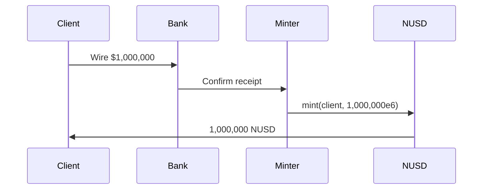

# Product Catalog

Detailed specifications for every Nexus Protocol product. Each entry covers what the product is, who it serves, how it works mechanically, and what the risks are.

---

## NUSD Stablecoin

### What is it?

NUSD is a USD-pegged stablecoin issued by the Nexus Protocol. Each NUSD is backed 1:1 by USD reserves held at a partner bank. It uses 6 decimal places (matching USDC), so 1 NUSD = 1,000,000 base units.

### Who is it for?

All protocol participants. NUSD is the base currency for vault deposits, derivative collateral, and settlement. Institutional partners use it as the on-chain representation of client USD deposits.

### How does it work?

1. Client sends a USD wire to the partner bank
2. A designated minter calls `MintController.mint()` to issue NUSD to the client's address
3. The MintController enforces a per-minter ceiling — each minter has a maximum allocation set by an admin
4. NUSD can be freely transferred between non-restricted addresses
5. To redeem, a burner burns the NUSD and initiates an off-chain wire back to the client

### What are the risks?

!!! warning "Key Risks"
    - **Counterparty risk:** NUSD is only as good as the USD reserves backing it. If the banking partner fails, redemption may be delayed.
    - **Smart contract risk:** A bug in the stablecoin contract could affect token balances. Mitigated by UUPS upgradeability and OpenZeppelin audited base contracts.
    - **Regulatory risk:** Stablecoin regulations are evolving. The UUPS upgrade mechanism allows the contract to be updated for compliance changes.

---

## Treasury Vault (nxTREASURY)

### What is it?

An ERC-4626 tokenized vault that accepts NUSD deposits and provides yield exposure to US Treasury securities. Depositors receive vault shares (nxTREASURY) whose price appreciates as the underlying T-bill portfolio generates interest.

### Who is it for?

- **Corporate treasuries** parking excess cash for short-term yield
- **Pension funds** seeking low-risk fixed-income allocation
- **Family offices** wanting on-chain treasury exposure with daily liquidity

### How does it work?

1. Investor deposits NUSD into the vault
2. The vault issues shares based on the current NAV: `shares = deposit / sharePrice`
3. A trusted NAV oracle reports the total asset value daily (reflecting T-bill yield accrual)
4. Share price = `totalAssets / totalSupply` — it increases as yield accrues
5. Investor withdraws by redeeming shares for NUSD at the current (higher) price

**Example trade:**

- Day 1: Deposit $500,000 NUSD at share price $1.00 → receive 500,000 nxTREASURY shares
- Day 365: NAV oracle reports 4.5% yield accrual → share price is now $1.045
- Withdraw all shares → receive $522,500 NUSD (profit: $22,500)

### What are the risks?

!!! warning "Key Risks"
    - **Oracle risk:** Share pricing depends on the NAV oracle reporting accurate values. A compromised oracle could misstate the vault's value.
    - **Liquidity risk:** If the vault's underlying assets are illiquid, large redemptions may be delayed.
    - **Interest rate risk:** If T-bill rates decline, future yield will be lower than historical.

---

## Principal Token (PT)

### What is it?

A fixed-rate instrument created by splitting vault shares via the YieldSplitter contract. Each PT represents a claim to exactly 1 NUSD at a specific maturity date. PTs trade at a discount to face value before maturity — the discount is the buyer's yield.

### Who is it for?

- **Fixed income desks** wanting a guaranteed return with a known maturity
- **Insurance companies** matching known liabilities with fixed-date payouts
- **Risk-averse investors** who want to lock in a rate rather than accept floating yield

### How does it work?

1. An investor deposits vault shares into the YieldSplitter
2. The splitter mints equal amounts of PT and YT (in NUSD terms)
3. PT can be sold on secondary markets at a discount
4. At maturity, the PT holder redeems for exactly 1 NUSD per PT

**Example trade:**

- Investor splits 100,000 NUSD worth of vault shares (maturity: 6 months)
- Receives 100,000 PT + 100,000 YT
- Sells PT at $0.978 each → receives $97,800 NUSD immediately
- PT buyer holds to maturity → redeems for $100,000 NUSD
- PT buyer's yield: $2,200 / $97,800 = 2.25% over 6 months (4.5% annualized)

### What are the risks?

!!! warning "Key Risks"
    - **Maturity risk:** PT has zero value before the splitter has enough assets to cover redemption. If vault assets decline significantly, PT redemption may receive less than 1:1.
    - **Liquidity risk:** PT must be traded on secondary markets — no guarantee of buyers at fair price.
    - **Smart contract risk:** The YieldSplitter contract manages the split/redeem logic.

---

## Yield Token (YT)

### What is it?

A floating-rate instrument that captures all yield generated by the underlying vault position until maturity. YT is the complement of PT — when you split vault shares, you get both. YT value depends entirely on how much yield the vault generates.

### Who is it for?

- **Trading desks** speculating on interest rate movements
- **Hedge funds** constructing rate views (bullish on rates = buy YT)
- **Yield farmers** seeking leveraged exposure to vault returns

### How does it work?

1. Created alongside PT via the YieldSplitter
2. Anyone can call `distributeYield()` to snapshot accrued yield and allocate it to YT holders
3. YT holders call `claimYield()` to receive accumulated NUSD payments
4. At maturity, YT holders redeem remaining accrued yield
5. After maturity, YT has no further value — all yield has been captured

**Example trade:**

- Hold 100,000 YT for a vault earning 4.5% APY
- Over 6 months, yield distributed: ~$2,250 NUSD
- If rates increase to 5.5%, yield over the same period would be ~$2,750
- YT value rises when rates rise, falls when rates fall

### What are the risks?

!!! warning "Key Risks"
    - **Interest rate risk (primary):** If vault yield drops to 0%, YT earns nothing. YT is a directional bet on rates.
    - **Time decay:** YT value decreases as maturity approaches, since less future yield remains to be captured.
    - **Yield distribution timing:** Yield is only allocated when `distributeYield()` is called. Delays in calling this function delay yield accrual to YT holders.

---

## Credit Vault

### What is it?

A collateralized lending facility. Investors deposit vault shares as collateral and borrow NUSD against them — similar to borrowing USD against a T-bill portfolio at a prime broker. This lets investors access liquidity without selling their yield-bearing position.

### Who is it for?

- **Hedge funds** wanting leveraged yield exposure
- **Proprietary trading desks** needing short-term NUSD liquidity
- **Institutional borrowers** who want to borrow against yield-bearing collateral

### How does it work?

1. Deposit vault shares (e.g., nxTREASURY) as collateral
2. Borrow NUSD up to 66.7% of collateral value (150% collateral ratio required)
3. Interest accrues continuously at 5% APY on the outstanding debt
4. Repay NUSD to reduce debt and withdraw collateral
5. If the loan-to-value ratio exceeds 120%, the position can be liquidated

**Example trade:**

- Deposit 1,000,000 nxTREASURY shares (worth $1,000,000 at current NAV)
- Borrow $600,000 NUSD (60% LTV — within the 66.7% max)
- Deploy the $600,000 for another purpose while still earning vault yield on $1M
- Effective yield: vault yield on $1M minus 5% borrow rate on $600K

| Parameter | Value |
|-----------|-------|
| Collateral ratio | 150% (max borrow = 66.7% of collateral) |
| Liquidation threshold | 120% LTV |
| Borrow rate | 5% APY (accrues per second) |
| Liquidation discount | 5% |

### What are the risks?

!!! warning "Key Risks"
    - **Liquidation risk:** If collateral value drops (NAV decline) or debt grows (interest accrual), the position may be liquidated. The borrower loses their collateral and the liquidator keeps the difference.
    - **Interest rate risk:** Borrow cost is fixed at 5% APY. If vault yield drops below 5%, the leveraged position loses money.
    - **Liquidity risk:** The Credit Vault must hold sufficient NUSD to fund borrows. If liquidity is exhausted, no new borrows are possible.

---

## ETF Wrapper (nxETF)

### What is it?

A basket product: one ERC-20 token (nxETF) backed by weighted allocations across multiple yield vaults. Depositors supply NUSD, which is automatically split across underlying vaults per target weights. This provides diversified yield exposure in a single token.

### Who is it for?

- **Family offices** wanting broad fixed-income exposure without managing individual positions
- **Wealth managers** looking for a single-token allocation to recommend
- **Corporate treasuries** seeking diversified yield across asset classes

### How does it work?

1. Admin configures the ETF with vault allocations (e.g., 60% Treasury, 40% Corporate Bond)
2. Depositor sends NUSD to the ETF Wrapper
3. Contract distributes NUSD across vaults per weight allocation
4. Depositor receives nxETF tokens proportional to their share of total NAV
5. Withdrawal redeems pro-rata from each underlying vault, returning NUSD

**Example trade:**

- ETF composition: 100% nxTREASURY (additional vaults to be added)
- Deposit $200,000 NUSD → contract deposits into Treasury Vault → receive nxETF tokens
- nxETF price per token = total NAV of all underlying vaults / total nxETF supply
- Withdraw: burn nxETF → receive NUSD proportional to underlying vault value

### What are the risks?

!!! warning "Key Risks"
    - **Concentration risk:** Currently a single vault (nxTREASURY). Diversification benefits increase as more vaults are added.
    - **Rebalancing risk:** Weight changes may result in slippage during large vault rebalances.
    - **Composability risk:** nxETF inherits the risks of every underlying vault.

---

## Structured Tranches (Planned)

### What is it?

A pool of vault collateral split into senior and junior tranches. Senior holders get first claim on collateral with a capped yield. Junior holders absorb first losses but receive all remaining yield above the senior cap.

### Who is it for?

- **Insurance companies and pension funds** (senior): capital preservation with modest guaranteed yield
- **Hedge funds and family offices** (junior): leveraged yield with willingness to absorb losses

### How will it work?

1. Depositors choose senior or junior tranche
2. NUSD is deposited into the underlying vault
3. At maturity, a payout waterfall determines distribution:
    - Senior holders receive principal + guaranteed yield (e.g., 3% APY)
    - Junior holders receive all remaining vault value after senior is paid
4. If the vault underperforms, junior absorbs the loss first, protecting senior

!!! note "Status: Planned"
    The StructuredProduct contract is designed but not yet deployed. See the [Derivatives Plan](../developers/contracts-reference.md) for the target interface.

### What are the risks?

!!! warning "Key Risks"
    - **Junior tranche risk:** First-loss position. If vault yield is less than the senior's guaranteed rate, junior holders lose money.
    - **Senior tranche risk:** In extreme scenarios (vault value drops below senior principal), even senior holders may lose capital.
    - **Maturity lock:** Funds may be locked until the maturity date.
