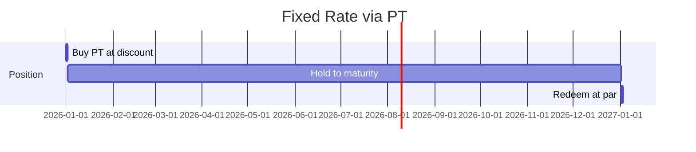

# Yield Strategies

How to construct positions for different investment objectives using Nexus Protocol products.

---

## Strategy 1: Fixed Rate via Principal Token

**Objective:** Lock in a known yield to maturity, eliminating rate risk.

**How it works:**

1. Purchase PT on secondary market at a discount to face value
2. Hold to maturity
3. Redeem for exactly 1 NUSD per PT

**Example:**

- Buy 1,000,000 PT at $0.957 each (maturity in 12 months)
- Cost: $957,000
- Redemption at maturity: $1,000,000
- Yield: $43,000 / $957,000 = **4.49% annualized**

**Best for:** Insurance companies matching liabilities, corporate treasuries with known future cash needs, pension funds with fixed payout obligations.

!!! note "Rate Comparison"
    The PT implied yield should be compared to direct T-bill purchases, money market funds, and commercial paper rates of similar maturity.

---

## Strategy 2: Yield Speculation via Yield Token

**Objective:** Express a view on interest rate direction with leveraged exposure.

**How it works:**

1. Purchase YT (or split vault shares to obtain YT and sell the PT)
2. Receive all yield from the underlying vault position until maturity
3. Profit increases if rates rise; position loses value if rates fall

**Example — Bullish on rates:**

- Vault currently yields 4.5% APY
- Buy 500,000 YT at $0.022 each (pricing in ~4.4% yield)
- Cost: $11,000
- If rates increase to 5.5%, yield earned over 6 months: ~$13,750
- Profit: $2,750 on $11,000 invested = **25% return**

**Example — Rates decline:**

- Same position, but rates drop to 3.0%
- Yield earned: ~$7,500
- Loss vs. cost: -$3,500

**Best for:** Trading desks with rate views, macro hedge funds, yield curve speculators.

---

## Strategy 3: Senior Tranche — Capital-Protected Yield (Planned)

**Objective:** Earn a modest but highly protected yield with first-claim seniority.

**How it works:**

1. Deposit NUSD into the senior tranche of a StructuredProduct
2. Junior depositors absorb losses first
3. At maturity, senior receives principal + guaranteed yield (e.g., 3% APY)

**Example:**

- Deposit $5,000,000 into senior tranche (3% guaranteed)
- At maturity: receive $5,150,000
- Even if vault yield drops to 1%, senior is protected (junior absorbs the shortfall)

**Best for:** Insurance reserves, pension fund fixed allocations, endowments.

!!! note "Status: Planned"
    Structured tranches are designed but not yet deployed.

---

## Strategy 4: Junior Tranche — Leveraged Yield (Planned)

**Objective:** Earn enhanced yield by accepting first-loss risk.

**How it works:**

1. Deposit NUSD into the junior tranche
2. If the vault outperforms the senior guaranteed rate, junior captures all excess
3. If the vault underperforms, junior absorbs losses before senior

**Example (80/20 split, 3% senior target, vault yields 5%):**

- Senior gets 3% on their 80% allocation = 2.4% of total
- Remaining yield: 5.0% - 2.4% = 2.6% of total → all to junior (20% allocation)
- Junior effective yield: 2.6% / 20% = **13% on invested capital**

**Best for:** Hedge funds, family offices with higher risk tolerance, yield-seeking capital.

---

## Strategy 5: Leveraged Yield via Credit Vault

**Objective:** Amplify vault yield by borrowing against your position.

**How it works:**

1. Deposit vault shares as collateral in the Credit Vault
2. Borrow NUSD at 5% APY
3. Re-deposit the borrowed NUSD into the vault for additional shares
4. Net yield = (vault yield on total position) - (borrow cost on debt)

**Example — 2x leverage:**

- Start with $1,000,000 in vault shares
- Borrow $600,000 NUSD (60% LTV)
- Deposit $600,000 into vault → now have $1,600,000 in vault exposure
- Vault yield: 4.5% on $1,600,000 = $72,000
- Borrow cost: 5.0% on $600,000 = $30,000
- Net yield: $42,000 on $1,000,000 original = **4.2% effective yield**

!!! warning "Liquidation Risk"
    If the vault NAV drops, the collateral value decreases while debt remains. At 120% LTV (collateral value / debt), the position is liquidated. Monitor LTV continuously.

**Best for:** Sophisticated investors comfortable with leverage, prop trading desks, yield farming strategies.

---

## Strategy 6: Diversified Yield via ETF Wrapper

**Objective:** Gain broad exposure to the Nexus vault ecosystem in a single token.

**How it works:**

1. Deposit NUSD into the ETF Wrapper
2. Contract splits deposit across vaults per allocation weights
3. Hold nxETF token — price reflects weighted average performance of all underlying vaults
4. Withdraw to convert back to NUSD

**Current composition:** 100% nxTREASURY (additional vaults will be added).

**Best for:** Passive allocation mandates, wealth management model portfolios, diversified treasury management.

---

## Strategy Comparison Matrix

| Strategy | Target Yield | Risk Level | Liquidity | Minimum Sophistication |
|----------|-------------|------------|-----------|----------------------|
| Direct vault deposit | ~4.5% (floating) | Low | Daily | Low |
| Fixed rate (PT) | ~4.5% (locked) | Very Low | Secondary market | Low |
| Yield speculation (YT) | Variable | Medium | Secondary market | High |
| Senior tranche | ~3% (guaranteed) | Very Low | At maturity | Low |
| Junior tranche | ~13%+ (leveraged) | High | At maturity | Medium |
| Leveraged yield (Credit Vault) | ~4-6% (leveraged) | Medium-High | Continuous | High |
| Diversified (ETF) | Blended | Low | Daily | Low |
